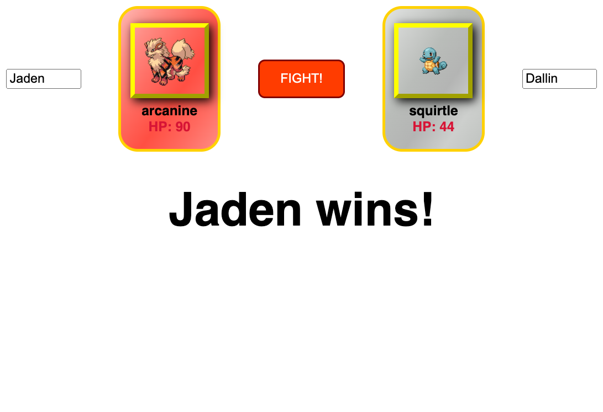
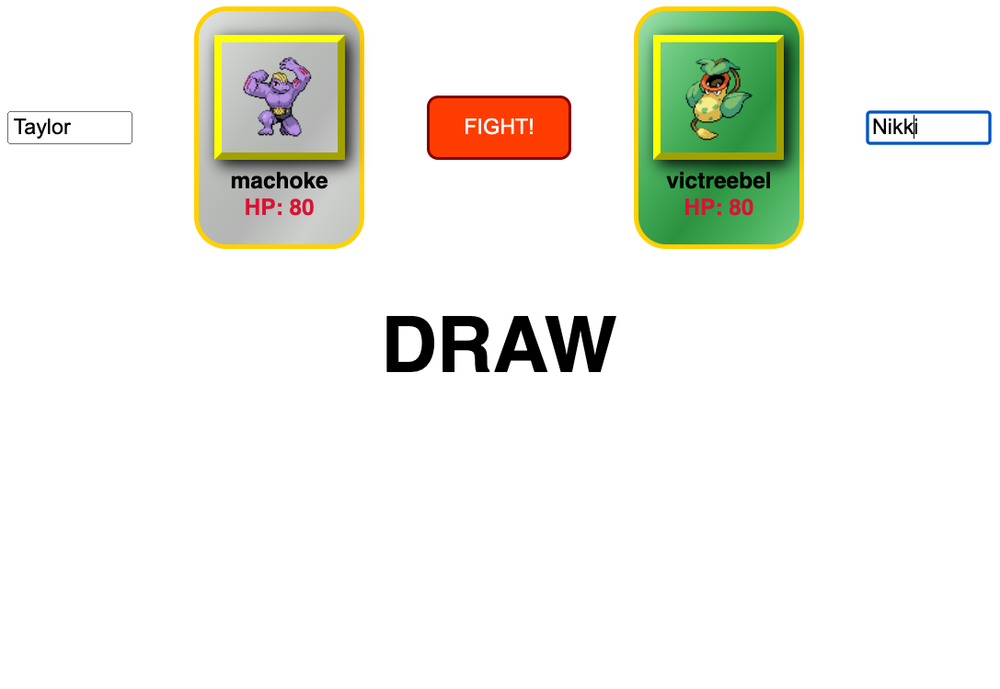

## Pokemon battle app

To run locally, clone repo, run `npm install` and then run `npm run dev` and navigate to`http://localhost:3000/pokemon`.

This gets 2 random Pokemon from the Pokemon API and the Pokemon with the highest HP wins.  You can also add a name for each user. And it is possible to get a draw.  I also added some CSS to dynamically change the background color for certain types of Pokemon.

